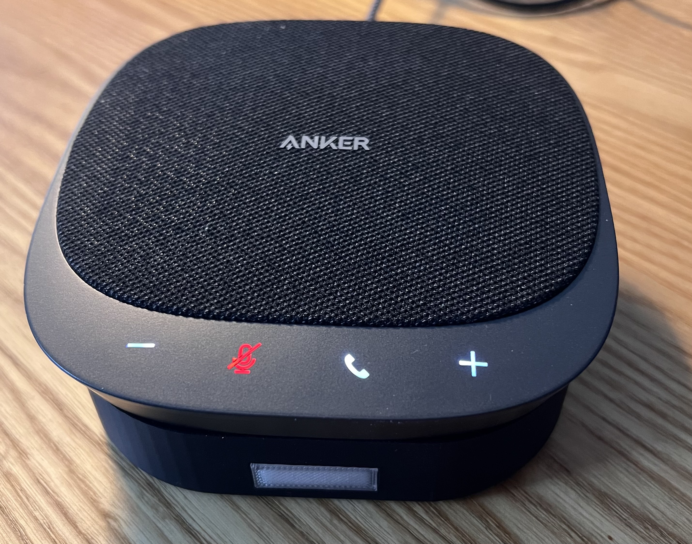
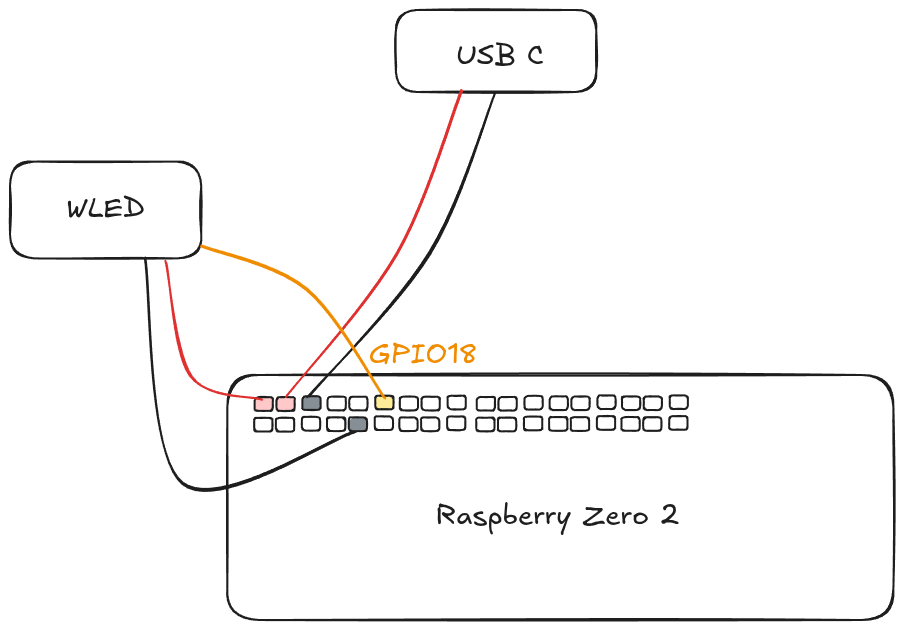
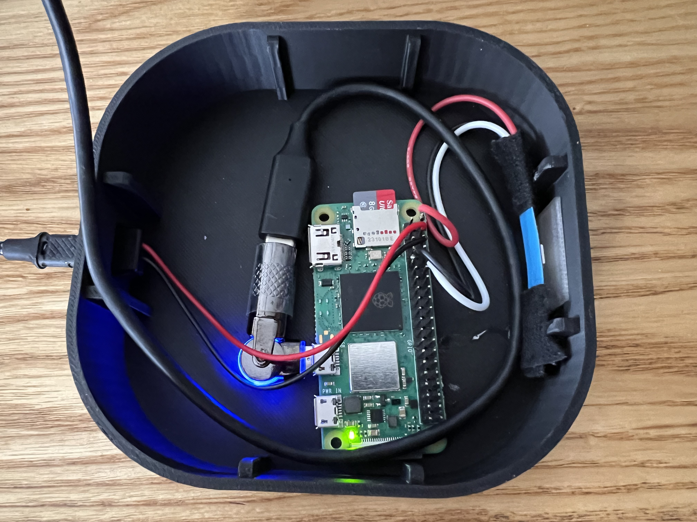
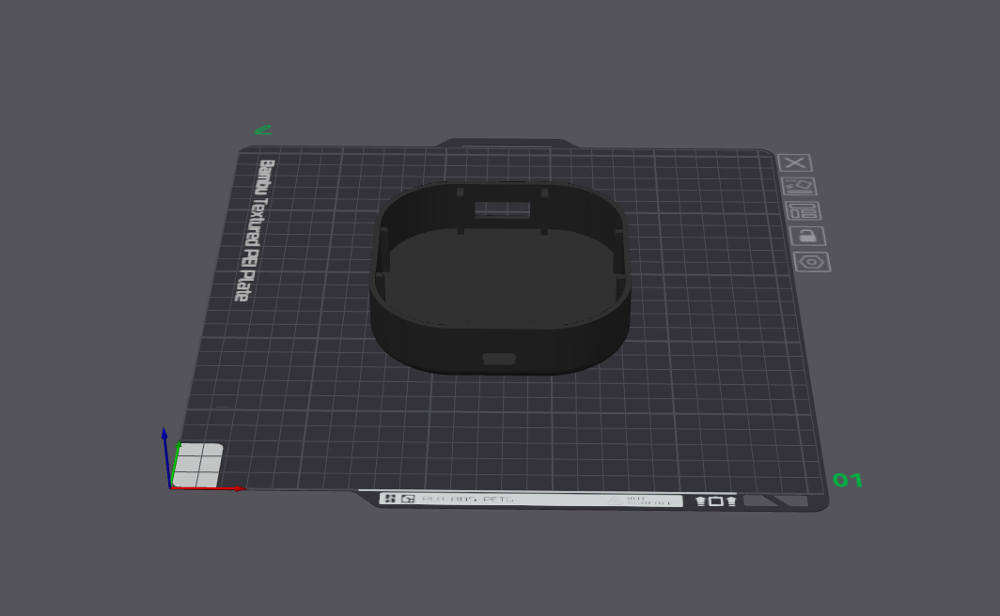

# Nabu Mini



A smart home solution for voice control using Wyoming protocol with Raspberry Pi and Anker PowerConf S330.

## Hardware

- [Raspberry Pi Zero 2 W](https://www.amazon.de/Raspberry-Pi-Zero-2-W/dp/B09KLVX4RT)
- [Anker PowerConf S330](https://www.amazon.de/Anker-Lautsprecher-Konferenzlautsprecher-Raumabdeckung-A3308011/dp/B09FJ7LWX4)
- [USB-C Netzteil für Raspberry Pi](https://www.amazon.de/offizieller-Raspberry-Pi-Netzteil-Supply-Wei%C3%9F/dp/B0CM46P7MC)
- [WS2812B LED Strip 5V](https://www.amazon.de/WS2812B-Individuell-Adressierbar-Vollfarbiger-Wasserdicht/dp/B08YWQLXRS)
- [Micro USB auf USB-C Adapter](https://www.amazon.de/dp/B0DYDQRTZT)
- [USB-C Buchse](https://www.amazon.de/dp/B0CZLD8NKS)

### Wiring Diagram

|  |  |
|:-------------------------:|:-------------------------:|
| **Wiring Diagram** | **Real Implementation** |

The wiring diagram shows the connections between components:
- The WS2812B LED strip connects to the Raspberry Pi Zero 2's GPIO18 pin for data, and to power/ground
- The USB-C connector is wired to provide power to the system
- The Anker S330 connects via USB to the Raspberry Pi (not shown in diagram)

## Raspberry Pi Image
Recommended image:
Raspberry Pi Imager -> Raspberry Pi Zero 2 -> Other -> Raspbian Lite 64-bit

# Installation

## Clone Repository

```sh
# Clone the nabu_mini repository
git clone https://github.com/tobiaskuntzsch/nabu_mini.git
cd nabu_mini
```

## Install Dependencies

```sh
# System dependencies
sudo apt-get update -y
sudo apt-get install --no-install-recommends git python3-dev libopenblas-dev build-essential -y

# Python packages available through apt
sudo apt-get install --no-install-recommends python3-hidapi python3-rpi.gpio python3-pip -y

# Python packages only available via pip
sudo pip3 install adafruit-circuitpython-neopixel adafruit-blinka wyoming wyoming-satellite --break-system-packages

# Correct HID package for S330 buttons (python-hid, NOT hidapi)
sudo pip3 install hid --break-system-packages


# Optional audio processing packages
sudo pip3 install webrtc-noise-gain pysilero-vad --break-system-packages
```

## Scripts in this Repository

### 1. s330_buttons.py

This script interfaces with the Anker PowerConf S330 device via HID protocol to monitor button presses:
- Volume Up/Down buttons control system volume
- Phone button triggers a wake word event for the voice assistant

```sh
# Run the button monitoring script
sudo python3 s330_buttons.py
```

### 2. neopixel_led_service.py

This script controls a WS2812B LED strip to provide visual feedback for Wyoming events:
- Blue when wake word is detected
- Yellow during streaming/voice activity
- Green when transcript is received
- Red when satellite is disconnected

The script is configurable with several command line parameters:

```sh
# Run the LED service with default settings (1 LED on pin 18)
sudo python3 neopixel_led_service.py --uri 'tcp://127.0.0.1:10500'

# Configure the LED strip parameters
sudo python3 neopixel_led_service.py --uri 'tcp://127.0.0.1:10500' \
  --num-leds 8 \
  --pin 18 \
  --led-brightness 0.3
```

Available parameters:
- `--uri`: Wyoming event URI (required)
- `--num-leds`: Number of LEDs in the strip (default: 1)
- `--pin`: GPIO pin number for the LED strip (default: 18, which is D18)
- `--led-brightness`: LED brightness from 0.0 to 1.0 (default: 0.5)
- `--debug`: Enable debug logging

## Find Anker S330 Device

```sh
aplay -L | grep -i s330 | grep -i plughw
# Expected output: plughw:CARD=S330,DEV=0
```

# Setting Up as Services

## Create Service Files

```sh
sudo systemctl edit --force --full nabu-buttons.service
sudo systemctl edit --force --full nabu-leds.service
```

### nabu-buttons.service
```ini
[Unit]
Description=Anker S330 Button Service
After=network-online.target

[Service]
Type=simple
ExecStart=/usr/bin/python3 /home/pi/nabu_mini/s330_buttons.py
WorkingDirectory=/home/pi/nabu_mini
Restart=always
RestartSec=1

[Install]
WantedBy=default.target
```

### nabu-leds.service
```ini
[Unit]
Description=NeoPixel LEDs Service

[Service]
Type=simple
ExecStart=/usr/bin/python3 /home/pi/nabu_mini/neopixel_led_service.py --uri 'tcp://127.0.0.1:10500'
WorkingDirectory=/home/pi/nabu_mini
Restart=always
RestartSec=1

[Install]
WantedBy=default.target
```

## Activate Services

```sh
sudo systemctl daemon-reload
sudo systemctl enable nabu-buttons.service
sudo systemctl enable nabu-leds.service
sudo systemctl start nabu-buttons.service
sudo systemctl start nabu-leds.service
```

# Verification

```sh
sudo systemctl status nabu-buttons.service nabu-leds.service
```

# Troubleshooting

```sh
# View the logs for the button service
journalctl -u nabu-buttons.service -f

# View the logs for the LED service
journalctl -u nabu-leds.service -f
```

# Restarting Services

```sh
sudo systemctl daemon-reload
sudo service nabu-buttons restart
sudo service nabu-leds restart
```

# Wyoming Satellite Integration

## Setting up Wyoming Satellite

```sh
# Clone the Wyoming Satellite repository
git clone https://github.com/rhasspy/wyoming-satellite.git
cd ~/wyoming-satellite

# Setup Wyoming Satellite
script/setup

# Install additional audio processing packages
.venv/bin/pip3 install 'pysilero-vad==1.0.0'
.venv/bin/pip3 install 'webrtc-noise-gain==1.2.3'

# Check available options
script/run --help
```

## Wyoming Satellite Service Configuration

Create a systemd service file for Wyoming Satellite:

```sh
sudo systemctl edit --force --full wyoming-satellite.service
```

Add the following content:

```ini
[Unit]
Description=Wyoming Satellite
Wants=network-online.target
After=network-online.target
Requires=nabu-leds.service

[Service]
Type=simple
ExecStart=/home/pi/wyoming-satellite/script/run \
  --name 'Nabu Mini <ROOM NAME>' \
  --uri 'tcp://0.0.0.0:10700' \
  --mic-command 'arecord -D plughw:CARD=S330,DEV=0 -r 16000 -c 1 -f S16_LE -t raw' \
  --snd-command 'aplay -D plughw:CARD=S330,DEV=0 -r 16000 -c 1 -f S16_LE -t raw' \
  --mic-auto-gain 7 \
  --mic-noise-suppression 3 \
  --wake-uri 'tcp://127.0.0.1:10400' \
  --wake-word-name 'ok_nabu' \
  --event-uri 'tcp://127.0.0.1:10500' \
  --snd-command-rate 16000 \
  --snd-volume-multiplier 0.2 \
  --awake-wav sounds/awake.wav \
  --done-wav sounds/done.wav
WorkingDirectory=/home/pi/wyoming-satellite
Restart=always
RestartSec=1

[Install]
WantedBy=default.target
```

Enable and start the service:

```sh
sudo systemctl daemon-reload
sudo systemctl enable wyoming-satellite.service
sudo systemctl start wyoming-satellite.service
```

## OpenWake Word Service

For local wake word detection, you can set up OpenWake:

```sh
# Clone the OpenWake repository
git clone https://github.com/rhasspy/wyoming-openwakeword.git
cd ~/wyoming-openwakeword

# Setup OpenWake
script/setup

# Download models (optional)
script/download-models

# Test available models
.venv/bin/wyoming-openwakeword --list-models
```

### OpenWake Service Configuration

Create a systemd service file for OpenWake:

```sh
sudo systemctl edit --force --full wyoming-openwake.service
```

Add the following content:

```ini
[Unit]
Description=Wyoming OpenWakeWord Service
Wants=network-online.target
After=network-online.target

[Service]
Type=simple
ExecStart=/home/pi/wyoming-openwakeword/script/run \
  --uri 'tcp://0.0.0.0:10400' \
  --preload-model 'ok_nabu' \
  --threshold 0.8
WorkingDirectory=/home/pi/wyoming-openwakeword
Restart=always
RestartSec=1

[Install]
WantedBy=default.target
```

Enable and start the service:

```sh
sudo systemctl daemon-reload
sudo systemctl enable wyoming-openwake.service
sudo systemctl start wyoming-openwake.service
```

With this setup, the wake word detection happens locally on your Nabu Mini device.

To use a remote wake word service instead, modify the `--wake-uri` in the Wyoming Satellite service to point to your remote server.

# 3D Printed Case

The Nabu Mini comes with 3D printable case files to create a nice enclosure for your device.

## 3D Models

- [Nabu Mini - Body (V5)](NabuMini%20-%20Body%20-%20V5.stl) - The main enclosure
- [Nabu Mini - Window (V1)](NabuMini%20-%20Window%20-%20V1.stl) - Transparent window part

## Printing Recommendations

- Print the main body with regular PLA (recommended 0.2mm layer height)
- Print the window with transparent material for better LED visibility



View these STL files in your favorite slicer software (like Cura, PrusaSlicer, etc.) to prepare for printing.
